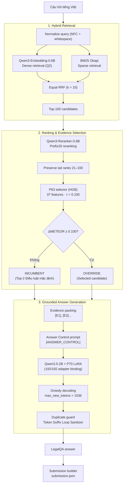

# Grounded Vietnamese Legal Question Answering System (UIT DSC 2026 Task 2)

[](https://github.com/astral-sh/ruff)
[](LICENSE)
[](https://www.python.org/downloads/)
[](docs/evaluation.md)
[](docs/evaluation.md)

DSC-LegalQA là repository tái lập hệ thống hỏi đáp pháp luật Việt Nam (LegalQA) được phát triển cho cuộc thi **UIT Data Science Challenge 2026 — Task 2**.

Production pipeline cuối cùng là `vNext + P63 + P70`, kết hợp Hybrid Retrieval, neural reranking, learned evidence selection và Qwen3.5-2B + Continued-LoRA để sinh câu trả lời grounded trên legal evidence được retrieval từ corpus.

- **Production pipeline:** `vNext + P63 + P70` (Lineage: `FROZEN_P3_G2_VNEXT_P63_P70`)
- **Kết quả official leaderboard:**
  - **METEOR:** **0.486776583** (metric xếp hạng chính)
  - **ROUGE-L:** **0.530283618** (metric phụ)
- **Submission SHA256 (provenance):** `ac6b796794cf3c422889620753743fa248d9ada8dd18d681f36d2e38784e1056`
- **Parameter count:** ~3.43B (đáp ứng giới hạn < 4B của BTC)

---

## 1. Kiến trúc hệ thống



---

## 2. Thành phần chính

1. **Hybrid Retrieval:** Kết hợp BM25Okapi ($k_1=1.5, b=0.75$) và `Qwen/Qwen3-Embedding-0.6B` (task instruction $Q2$), sau đó merge bằng Equal RRF ($k=10$) để lấy Top-100 candidates.
2. **Prefix20 reranking:** Dùng `Qwen/Qwen3-Reranker-0.6B` rerank 20 candidates đầu tiên bằng yes/no logit difference. Ranks 21–100 được giữ nguyên để tiết kiệm compute.
3. **P63 Evidence Selector:** `HistGradientBoostingRegressor` chạy trên 37 reference-free features với threshold $\tau = 0.100$. Nếu predicted gain $\Delta \ge 0.100$, selector sẽ `OVERRIDE` sang candidate tốt nhất; ngược lại giữ `INCUMBENT` (Top-2 Điều luật mặc định).
4. **P70 generator:** `Qwen/Qwen3.5-2B` kết hợp Continued-LoRA adapter (P70), áp dụng `[ANSWER_CONTROL]` và greedy decoding (`max_new_tokens=1536`).
5. **Production duplicate guard:** `token_suffix_loop_sanitizer.py` (SHA256: `1d58bb1cac5bef635e39500959b13e77bbd1da3d7c18ec82edeeac5e09713527`) phát hiện và cắt bỏ các suffix repetition loops trước khi xuất answer cuối cùng.

---

## 3. Parameter budget (<4B)

BTC UIT DSC 2026 quy định tổng parameter count của toàn bộ hệ thống phải **dưới 4 tỷ tham số (< 4B)**:

$$\sum \text{Params (Neural + LoRA)} = 595.776.512 + 595.776.512 + 2.213.241.664 + 21.823.488 = \mathbf{3.426.618.176} \approx \mathbf{3,43B}$$

| Role | Model / Component | Revision / Artifact | Params / Complexity | Status (< 4B) |
|---|---|---|---:|:---:|
| **Dense Retriever** | `Qwen/Qwen3-Embedding-0.6B` | `97b0c614be4d...` | 595.776.512 | PASS |
| **Neural Reranker** | `Qwen/Qwen3-Reranker-0.6B` | `e61197ed4502...` | 595.776.512 | PASS |
| **Generator Base** | `Qwen/Qwen3.5-2B` | `15852e8c1636...` | 2.213.241.664 | PASS |
| **Generator LoRA** | P70 LoRA Adapter | `193913014b49...` | 21.823.488 | PASS |
| **Subtotal (Neural + LoRA)** | Mạng nơ-ron và LoRA | — | **3.426.618.176** | **PASS (< 4B)** |
| **Evidence Selector** | `P63 HistGradientBoostingRegressor` | `1654bf0184f6...` | 100 trees (6.030 tree nodes, 387 KB) | PASS |
| **Total System** | **Toàn bộ pipeline** | — | **3.426.618.176 neural (+ 6.030 tree nodes P63)** | **PASS (< 4B)** |

> [!NOTE]
> **Chi tiết về P63 Selector:** P63 là một non-neural tree ensemble (`HistGradientBoostingRegressor`) gồm 100 cây và 6.030 tree nodes trên 37 features (file pickle: 387.527 bytes). Cấu trúc nút cây không quy đổi 1:1 sang tensor weights như neural net. Dù cộng trực tiếp 6.030 nút cây vào tổng, pipeline vẫn chỉ có **3.426.624.206** tham số, đáp ứng giới hạn 4B với hơn 573 triệu tham số headroom (~14.33%).

---

## 4. Quick start

### Bước 1: Cài đặt môi trường
```bash
git clone https://github.com/Chef221/DSC-LegalQA.git
cd DSC-LegalQA

# Cài đặt dependency từ lockfile
pip install -r requirements-lock.txt
pip install -e .
```

### Bước 2: Kiểm tra artifact và environment
```bash
# Verify chữ ký SHA256 của 5 production artifacts
python scripts/verify_artifacts.py

# Verify môi trường reproduction (Strict Mode - bắt buộc cho P70 reproduction)
python scripts/verify_environment.py --strict

# (Tùy chọn) Kiểm tra tương thích thông tin nếu đang chạy trên máy dev
python scripts/verify_environment.py

# Chạy test suite
pytest -v -m "not gpu"
```

### Bước 3: Chạy inference
```bash
python scripts/run_inference.py \
    --input_questions data/public-official.json \
    --chunks_path data/chunks.jsonl \
    --output_submission submission.json \
    --device cuda
```

---

## 5. Cấu trúc repo

```text
DSC-LegalQA/
├── artifacts/                  # Trọng số P70 LoRA và model P63 Selector
│   ├── MANIFEST.json           # Danh mục SHA256 và kích thước file artifact
│   ├── p63_selector/           # Model P63 Selector và metadata
│   └── p70_adapter/            # Trọng số adapter và config LoRA
├── configs/                    # Config cho pipeline và decoding
├── data/                       # Dữ liệu schema mẫu và test fixtures
├── docs/                       # Tài liệu kỹ thuật, architecture và evaluation
│   ├── approved-models.md      # Danh sách model BTC phê duyệt
│   ├── architecture.md         # Thiết kế pipeline và component contracts
│   ├── competition.md          # Quy chế thi và scoring contract của BTC
│   ├── dataset.md              # Cấu trúc dataset và snapshot quan sát được
│   ├── evaluation.md           # Kết quả official leaderboard và internal evaluation
│   ├── reproduction.md         # Hướng dẫn tái lập inference và training
│   └── technical-evolution.md  # Lịch sử phát triển kỹ thuật của pipeline
├── scripts/                    # CLI scripts
│   ├── run_inference.py        # End-to-end inference runner (vNext + P63 + P70)
│   ├── train_selector.py       # Script train P63 Selector (Fail-Closed)
│   ├── train_p70_lora.py       # Script train Continued-LoRA P70 (Fail-Closed)
│   ├── verify_artifacts.py     # Verify SHA256 các frozen artifacts
│   └── verify_environment.py   # Verify environment và package versions
├── src/dsc_legalqa/            # Source code chính của package
│   ├── data/                   # Data loader, schema, normalization
│   ├── generation/             # Qwen3.5-2B + P70 engine, prompt builder, packer
│   ├── postprocess/            # token_suffix_loop_sanitizer & duplicate guard
│   ├── reranking/              # Qwen3-Reranker-0.6B Prefix20
│   ├── retrieval/              # BM25, Qwen3 Dense, Equal RRF
│   ├── selector/               # P63 selector, feature extractor, materializer
│   └── utils/                  # Config loader và budget auditor
└── tests/                      # Layered tests (Unit, Provenance, Wiring)
```

---

## 6. License & Disclaimer

Dự án được phát hành theo giấy phép [MIT License](LICENSE). Các pre-trained models tuân theo giấy phép gốc của tác giả (`Apache-2.0` cho Qwen).

Hệ thống được phát triển phục vụ mục đích nghiên cứu trong khuôn khổ UIT Data Science Challenge 2026, **không có giá trị thay thế tư vấn pháp lý chuyên nghiệp từ luật sư hoặc cơ quan nhà nước có thẩm quyền**.
