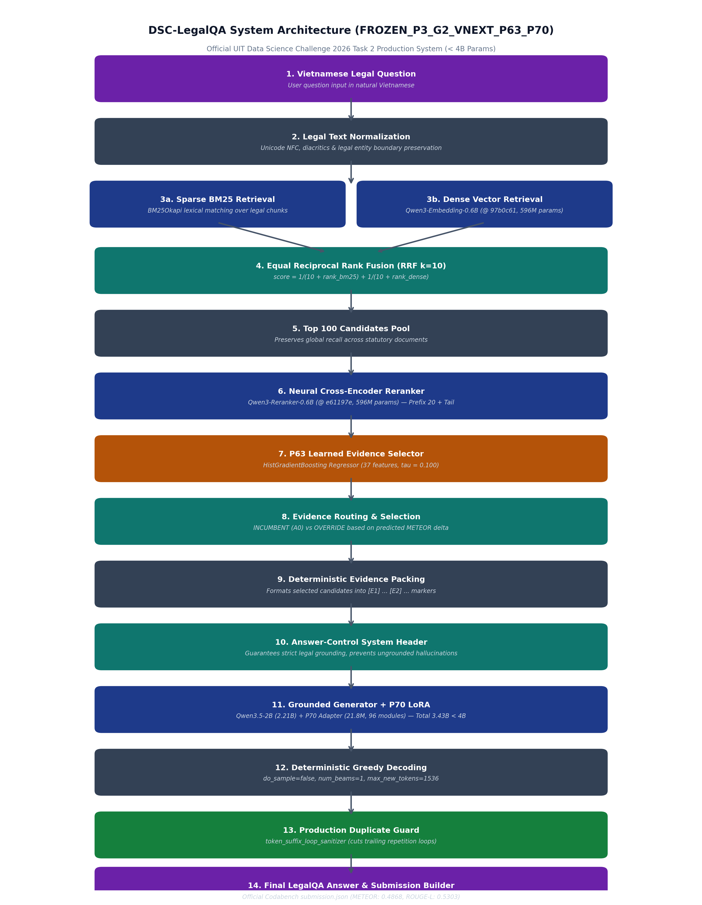

# DSC-LegalQA: Hệ Thống Trả Lời Câu Hỏi Pháp Luật Việt Nam (UIT Data Science Challenge 2026)

[](LICENSE)
[](https://www.python.org/)
[](configs/models.yaml)
[](docs/evaluation.md)

Kho mã nguồn chính thức của hệ thống **DSC-LegalQA** (dòng kiến trúc sản xuất `FROZEN_P3_G2_VNEXT_P63_P70`) tham gia cuộc thi **UIT Data Science Challenge 2026 (Task 2 - Legal Question Answering)** do Trường Đại học Công nghệ Thông tin - ĐHQG-HCM tổ chức.

---

## 1. Tên Dự Án
**DSC-LegalQA** — Grounded Vietnamese Legal Question Answering System.

## 2. Bài Toán (Task Definition)
- **Nhiệm vụ:** Trả lời câu hỏi pháp luật Việt Nam bằng câu trả lời văn xuôi tự nhiên, chính xác và có căn cứ pháp lý rõ ràng.
- **Đầu vào:** Một câu hỏi pháp lý bằng tiếng Việt tự nhiên.
- **Đầu ra:** Câu trả lời văn xuôi tiếng Việt được bảo chứng bởi các điều khoản pháp luật thực tế, kèm trích dẫn văn bản và điều luật.

## 3. Kết Quả Chính Thức Trên Bảng Xếp Hạng Cuộc Thi
Hệ thống sản xuất **P70** đạt kết quả chính thức được ghi nhận bởi Ban tổ chức:

| Metric | Điểm Số Chính Thức | Ghi Chú |
|---|---:|---|
| **METEOR (Chỉ số xếp hạng chính)** | **0.486776583** | Đánh giá bởi NLTK METEOR chính thức |
| **ROUGE-L (Chỉ số xếp hạng phụ)** | **0.530283618** | Đánh giá bởi vendored ROUGE-L |

> **Lưu ý khoa học:** Điểm số trên là kết quả thực tế trên bảng xếp hạng cuộc thi. Dự án không tự xưng "State-of-the-Art" toàn cầu nếu không có đối sánh chuẩn mực bên ngoài.

## 4. Kiến Trúc Tổng Quan
Hệ thống vận hành theo đường ống đa giai đoạn lai ghép:

```text
Vietnamese Legal Question
        │
        ▼
Legal Text Normalization (NFC)
        │
        ├──────────────► BM25 Sparse Lexical Retrieval
        │
        └──────────────► Dense Vector Retrieval (Qwen3-Embedding-0.6B)
                         │
BM25 ───────────────────┤
Dense ──────────────────┘
        │
        ▼
Equal Reciprocal Rank Fusion (k=10) ──► Top 100 Candidates Pool
        │
        ▼
Neural Cross-Encoder Reranker (Qwen3-Reranker-0.6B) ──► Prefix 20 Reranked + Preserved Tail
        │
        ▼
P63 Learned Evidence Selector (HistGradientBoosting, 37 features, tau = 0.100)
        │
        ├── Incumbent Action (A0)
        └── Override Action (Top-K Pair / Non-article Fallback)
        │
        ▼
Deterministic Evidence Packing ([E1] ... [E2] ...)
        │
        ▼
Answer-Control System Header Guard
        │
        ▼
Grounded Generator (Qwen/Qwen3.5-2B + Final P70 LoRA Adapter)
        │
        ▼
Deterministic Greedy Decoding (max_tokens=1536, no_sample)
        │
        ▼
Production Duplicate Guard (Loop Sanitizer @ 1d58bb1)
        │
        ▼
Final LegalQA Prose Answer ──► Codabench Submission Builder
```



## 5. Thành Phần Hệ Thống
1. **Tiền xử lý & Chuẩn hóa:** Chuẩn hóa Unicode NFC, bảo toàn tuyệt đối các cấu trúc và thực thể pháp lý.
2. **Truy xuất lai (BM25 + Qwen3-Embedding):** Kết hợp tìm kiếm từ khóa chính xác và vector ngữ nghĩa đa chiều.
3. **Hợp nhất đối xứng (Equal RRF):** Hằng số $k=10$ triệt tiêu thiên lệch giữa các nhánh.
4. **Xếp hạng lại nơ-ron (Qwen3-Reranker):** Đánh giá tương quan ngữ cảnh sâu trên Prefix 20 và bảo tồn đuôi ứng viên.
5. **Bộ chọn căn cứ P63:** Bộ phân loại gradient boosting với 37 đặc trưng phi tham chiếu và ngưỡng quyết định $\tau = 0.100$.
6. **Mô hình sinh có căn cứ:** Qwen3.5-2B kết hợp bộ chuyển đổi P70 LoRA được huấn luyện trên dữ liệu chính thức.
7. **Bộ lọc lặp lặp sản xuất (Duplicate Guard):** Loại bỏ triệt để các chu kỳ lặp lại token ở cuối câu trả lời.

## 6. Luồng Dữ Liệu
Chi tiết luồng xử lý và đặc tả từng module được mô tả tại [docs/architecture.md](docs/architecture.md).

## 7. Các Mô Hình Sử Dụng
Mọi mô hình sử dụng đều nằm trong danh sách được BTC phê duyệt và có giấy phép nguồn mở tương thích:
- Dense Retriever: `Qwen/Qwen3-Embedding-0.6B` (Pinned revision: `97b0c614be4d77ee51c0cef4e5f07c00f9eb65b3`, Apache-2.0)
- Neural Reranker: `Qwen/Qwen3-Reranker-0.6B` (Pinned revision: `e61197ed45024b0ed8a2d74b80b4d909f1255473`, Apache-2.0)
- Base Generator: `Qwen/Qwen3.5-2B` (Pinned revision: `15852e8c16360a2fea060d615a32b45270f8a8fc`, Apache-2.0)
- LoRA Adapter: `p2_epoch1_qlora` (P70, 96 module LoRA, Apache-2.0 / Team-Trained)

## 8. Tuân Thủ Giới Hạn Tham Số (< 4B)
Tổng tham số của toàn bộ hệ thống là **3.426.618.176 tham số** (xấp xỉ 3,43 tỷ), hoàn toàn tuân thủ quy định $< 4.000.000.000$ tham số của cuộc thi với biên độ an toàn là **+573.381.824 tham số (14,33%)**.
Chi tiết chứng minh tại [docs/approved-models.md](docs/approved-models.md).

## 9. Cấu Trúc Dữ Liệu Chính Thức
Dữ liệu thô cuộc thi không được đưa lên kho mã nguồn công khai. Vui lòng tham khảo [data/README.md](data/README.md) để biết cách đặt dữ liệu vào thư mục `data/`.

## 10. Cấu Trúc Repository
```text
DSC-LegalQA/
├── README.md               # Tài liệu tổng quan tiếng Việt
├── LICENSE                 # Giấy phép nguồn mở MIT
├── pyproject.toml          # Cấu hình cài đặt gói package
├── requirements.txt        # Danh sách thư viện phụ thuộc
├── requirements-lock.txt   # Pinned versions phục vụ tái lập
├── Dockerfile              # Môi trường container hóa
├── configs/                # Cấu hình tập trung (models, retrieval, selector, generation)
├── src/dsc_legalqa/        # Mã nguồn lõi chuẩn hóa
├── scripts/                # Kịch bản thực thi và tái lập
├── artifacts/              # Trọng số đóng băng (P63 selector, P70 LoRA adapter)
├── tests/                  # Bộ kiểm thử đơn vị tự động
├── docs/                   # Tài liệu kỹ thuật chi tiết
├── examples/               # File câu hỏi mẫu và format bài nộp
└── data/                   # Thư mục chứa dữ liệu người dùng tự cung cấp
```

## 11. Quick Start
```bash
# 1. Clone repo
git clone https://github.com/Chef221/DSC-LegalQA.git
cd DSC-LegalQA

# 2. Cài đặt môi trường
pip install -e .

# 3. Chạy kiểm thử tự động
python -m pytest tests -v
```

## 12. Reproduction
Xem hướng dẫn chi tiết quy trình Tái lập Nhanh và Tái lập Huấn Luyện Toàn Diện tại [docs/reproduction.md](docs/reproduction.md).

## 13. Evaluation
Cách đánh giá câu trả lời dự đoán bằng công cụ chấm điểm chính thức của BTC:
```bash
python scripts/evaluate.py --references data/train_refs.json --predictions submission.json
```
Xem phân tích chi tiết tại [docs/evaluation.md](docs/evaluation.md).

## 14. Tiến Trình Kỹ Thuật (Technical Evolution)
Hệ thống phát triển qua các mốc cải tiến thực chất:
- **P62:** Cải tiến lựa chọn căn cứ đạt bước nhảy **+0.0410 METEOR**.
- **P63:** Tinh gọn và triển khai bộ chọn học máy với 37 đặc trưng phi tham chiếu ($	au = 0.100$).
- **P70:** Huấn luyện tinh chỉnh LoRA trên Qwen3.5-2B, được triển khai qua phê duyệt hạn chót và đạt kết quả xuất sắc trên Leaderboard.
Chi tiết xem tại [docs/technical-evolution.md](docs/technical-evolution.md).

## 15. Tuân Thủ Thể Lệ Cuộc Thi (Competition Compliance)
Toàn bộ quy định về đăng ký mô hình, cấm sử dụng API, bản quyền dữ liệu và trách nhiệm minh bạch mã nguồn được trình bày tại [docs/competition.md](docs/competition.md).

## 16. Model Card & Data Statement
- [docs/model-card.md](docs/model-card.md)
- [docs/data-statement.md](docs/data-statement.md)

## 17. Giấy Phép và Lời Cảm Ơn
Dự án được phát hành theo giấy phép [MIT License](LICENSE).
Trân trọng cảm ơn Ban tổ chức cuộc thi UIT Data Science Challenge 2026, Trường Đại học Công nghệ Thông tin - ĐHQG-HCM, và cộng đồng nghiên cứu nguồn mở (Qwen Team, Hugging Face, Scikit-learn, NLTK).
