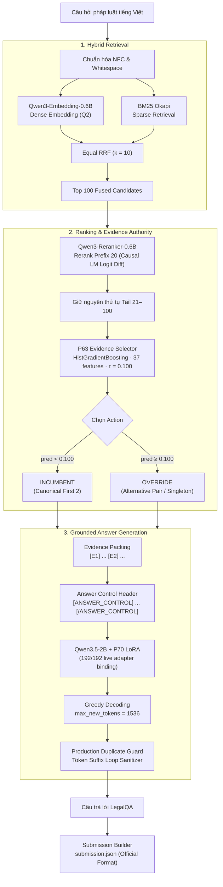

# Grounded Vietnamese Legal Question Answering System (UIT DSC 2026 Task 2)

[](https://github.com/astral-sh/ruff)
[](LICENSE)
[](https://www.python.org/downloads/)
[](docs/evaluation.md)
[](docs/evaluation.md)

Kho mã nguồn chính thức tái lập kiến trúc hệ thống hỏi đáp pháp luật Việt Nam (Legal Question Answering) đạt kết quả xếp hạng chính thức tại cuộc thi **UIT Data Science Challenge 2026** (Task 2).

- **Kiến trúc sản xuất:** `vNext + P63 + P70` (Lineage: `FROZEN_P3_G2_VNEXT_P63_P70`)
- **Kết quả Leaderboard chính thức:**
  - **METEOR:** **0.486776583** (Chỉ số xếp hạng chính)
  - **ROUGE-L:** **0.530283618** (Chỉ số xếp hạng phụ)
- **Mã định danh bản nộp:** `ac6b796794cf3c422889620753743fa248d9ada8dd18d681f36d2e38784e1056`
- **Tổng số tham số học được:** **3,43 tỷ** (Tuân thủ nghiêm ngặt quy chế $< 4.000.000.000$ tham số)

---

## 1. Sơ Đồ Kiến Trúc Hệ Thống (Architecture Flowchart)

Hệ thống được tổ chức thành một quy trình phân tầng ba giai đoạn tất định:



---

## 2. Các Đặc Tính Kỹ Thuật Trọng Tâm

1. **Truy xuất lai cân bằng (Equal Hybrid RRF):** Kết hợp sức mạnh từ khóa chính xác của BM25Okapi với năng lực hiểu ngữ cảnh của mô hình nhúng `Qwen/Qwen3-Embedding-0.6B` (chỉ dẫn pháp lý $Q2$), hợp nhất qua Reciprocal Rank Fusion ($k=10$) chọn Top 100 ứng viên.
2. **Xếp hạng lại thần kinh Prefix 20:** Ứng dụng `Qwen/Qwen3-Reranker-0.6B` tính toán hiệu số logit trực tiếp trên token `yes`/`no` cho 20 ứng viên hàng đầu, đồng thời bảo tồn nguyên vẹn thứ tự tail 21–100.
3. **Bộ lựa chọn căn cứ P63 (Learned Evidence Selector):** Bộ hồi quy `HistGradientBoostingRegressor` phân tích 37 đặc trưng không tham chiếu (reference-free) với ngưỡng can thiệp $\\tau = 0.100$, cải thiện thực nghiệm **+0.0410 METEOR** so với phương án mặc định.
4. **Bộ sinh câu trả lời P70:** Mô hình `Qwen/Qwen3.5-2B` kết hợp adapter Continued-LoRA (P70) được kiểm soát nghiêm ngặt qua khối `[ANSWER_CONTROL]` và giải mã tham lam (`max_new_tokens=1536`).
5. **Bộ lọc lặp vòng sản xuất (Token Suffix Loop Sanitizer):** Triển khai trực tiếp lõi thuật toán cắt tỉa lặp vòng tất định `token_suffix_loop_sanitizer.py` (SHA256: `1d58bb1cac5bef635e39500959b13e77bbd1da3d7c18ec82edeeac5e09713527`).

---

## 3. Bảng Kê Ngân Sách Tham Số Toàn Hệ Thống (< 4 Tỷ)

Theo quy định chính thức của Ban tổ chức UIT DSC 2026 Task 2, tổng số tham số của toàn bộ các mô hình cấu thành hệ thống phải nhỏ hơn 4 tỷ:

$$\\sum \\text{Params} = 595.776.512 + 595.776.512 + 2.213.241.664 + 21.823.488 = 3.426.618.176 \\approx \\mathbf{3,43B}$$

| Vai Trò | Tên Mô Hình | Revision Pinned | Số Tham Số | Trạng Thái Tuân Thủ |
|---|---|---|---:|:---:|
| **Dense Retriever** | `Qwen/Qwen3-Embedding-0.6B` | `97b0c614be4d...` | 595.776.512 | PASS |
| **Neural Reranker** | `Qwen/Qwen3-Reranker-0.6B` | `e61197ed4502...` | 595.776.512 | PASS |
| **Generator Base** | `Qwen/Qwen3.5-2B` | `15852e8c1636...` | 2.213.241.664 | PASS |
| **Generator LoRA** | P70 LoRA Adapter | — | 21.823.488 | PASS |
| **Evidence Selector** | P63 HGB Regressor | — | 387 KB (Tree Ensemble) | PASS |
| **Tổng Hệ Thống** | **Toàn bộ pipeline** | — | **3.426.618.176** | **PASS (< 4B)** |

---

## 4. Bắt Đầu Nhanh (Quick Start)

### Bước 1: Cài đặt môi trường
```bash
git clone https://github.com/Chef221/DSC-LegalQA.git
cd DSC-LegalQA

# Cài đặt các gói phụ thuộc phiên bản đóng băng
pip install -r requirements-lock.txt
pip install -e .
```

### Bước 2: Xác minh tính toàn vẹn của hệ thống
```bash
# Kiểm tra chữ ký băm mật mã của toàn bộ 5 tạo tác sản xuất
python scripts/verify_artifacts.py

# Kiểm tra tính tương thích của môi trường Python/PyTorch/CUDA
python scripts/verify_environment.py

# Chạy bộ kiểm thử tự động
pytest -v -m "not gpu"
```

### Bước 3: Chạy suy luận sản xuất
```bash
python scripts/run_inference.py \
    --input_questions data/public-official.json \
    --chunks_path data/chunks.jsonl \
    --output_submission submission.json \
    --device cuda
```

---

## 5. Cấu Trúc Thư Mục Kho Mã Nguồn

```text
DSC-LegalQA/
├── artifacts/                  # Trọng số P70 LoRA và mô hình P63 Selector
│   ├── MANIFEST.json           # Danh mục băm mật mã SHA256 & kích thước tạo tác
│   ├── p63_selector/           # Mô hình P63 Selector và metadata
│   └── p70_adapter/            # Trọng số adapter và cấu hình LoRA
├── configs/                    # Cấu hình đóng băng (pipeline, decoding)
├── data/                       # Dữ liệu phục vụ kiểm thử / schema mẫu
├── docs/                       # Tài liệu thiết kế, quy chuẩn và bằng chứng thực nghiệm
│   ├── approved-models.md      # Danh sách toàn bộ mô hình được BTC phê duyệt
│   ├── architecture.md         # Chi tiết kiến trúc và bảng thành phần
│   ├── competition.md          # Quy chế & hợp đồng tính điểm của BTC
│   ├── dataset.md              # Đặc tả và thống kê dữ liệu quan sát được
│   ├── evaluation.md           # Bằng chứng kết quả Leaderboard & kiểm thử nội bộ
│   ├── reproduction.md         # Hướng dẫn tái lập suy luận & huấn luyện
│   └── technical-evolution.md  # Quá trình phát triển kỹ thuật 8 giai đoạn
├── scripts/                    # Các công cụ thực thi dòng lệnh
│   ├── run_inference.py        # Runner suy luận toàn trình vNext + P63 + P70
│   ├── train_selector.py       # Huấn luyện P63 Selector (Fail-Closed)
│   ├── train_p70_lora.py       # Huấn luyện Continued-LoRA P70 (Fail-Closed)
│   ├── verify_artifacts.py     # Xác minh toàn vẹn tạo tác đóng băng
│   └── verify_environment.py   # Xác minh môi trường thực thi
├── src/dsc_legalqa/            # Mã nguồn gói thư viện chính
│   ├── data/                   # Schema, bộ nạp dữ liệu
│   ├── evidence/               # Đóng gói căn cứ pháp luật ([E1], [E2])
│   ├── generation/             # Qwen3.5-2B + P70 Engine & prompt builder
│   ├── postprocess/            # token_suffix_loop_sanitizer & duplicate guard
│   ├── preprocessing/          # Chuẩn hóa văn bản tiếng Việt
│   ├── reranking/              # Qwen3-Reranker-0.6B Prefix20
│   ├── retrieval/              # BM25, Qwen3 Dense, Equal RRF
│   └── selector/               # P63 Selector, 37 features, materializer
└── tests/                      # Bộ kiểm thử phân tầng (Unit, Provenance, Wiring)
```

---

## 6. Giấy Phép & Tuyên Bố Trách Nhiệm

Dự án phát hành theo giấy phép [MIT License](LICENSE). Các mô hình nền tảng tuân thủ theo giấy phép tương ứng của nhà cung cấp (`Apache-2.0` cho Qwen).
