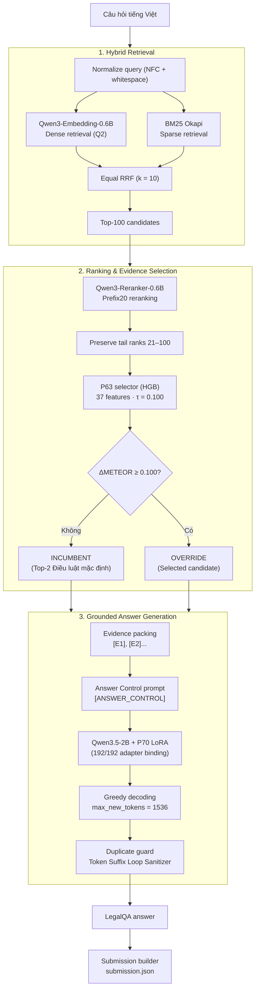

# Architecture — vNext + P63 + P70

Hệ thống **`vNext + P63 + P70`** (lineage: `FROZEN_P3_G2_VNEXT_P63_P70`) được thiết kế theo kiến trúc RAG 3 stage:
1. **Hybrid Retrieval:** Kết hợp BM25 Sparse và Qwen3 Dense Embedding qua Equal RRF ($k=10$).
2. **Ranking & Evidence Selection:** Neural reranking trên Prefix20 và P63 Evidence Selector ($\tau = 0.100$).
3. **Grounded Generation:** Prompt có Answer Control, generator Qwen3.5-2B + P70 LoRA và production duplicate guard.

---

## 1. Flowchart kiến trúc

---

## 2. Component specifications

| Component | Input | Operation | Output | Config / Model |
|---|---|---|---|---|
| **Query normalization** | Raw legal question | Unicode NFC normalization + collapse whitespace | Normalized query | Deterministic |
| **BM25 Sparse Retrieval** | Normalized query + corpus | Lexical matching qua BM25Okapi ($k_1=1.5, b=0.75$) | Top-100 sparse candidates | $k_1=1.5, b=0.75$ |
| **Dense Retrieval** | Normalized query + corpus | `Qwen/Qwen3-Embedding-0.6B` với prompt $Q2$, cosine similarity | Top-100 dense candidates | Rev: `97b0c614be...` (1024-dim, L2) |
| **Equal RRF Fusion** | Sparse + dense ranked lists | Merge 2 lists bằng Reciprocal Rank Fusion ($k=10$) | Top-100 fused candidates | $k=10$, equal weights $1.0/1.0$ |
| **Prefix20 Reranker** | Top-100 fused candidates | `Qwen/Qwen3-Reranker-0.6B` tính yes/no logit difference trên Prefix20 | Prefix20 reranked + tail 21–100 | Rev: `e61197ed45...`, Prefix=20 |
| **Candidate Materializer** | Reranked candidates | Sinh candidate sets (Incumbent First2, wider Top-K, non-article fallbacks) | Candidate list | 1..3 chunks per candidate |
| **P63 Feature Extractor** | Candidate sets | Trích xuất 37 reference-free features cho từng candidate | 37-dim feature vectors | 37 reference-free features |
| **P63 Evidence Selector** | 37-dim feature vectors | `HistGradientBoostingRegressor` dự báo score chênh lệch | Quyết định `INCUMBENT` hoặc `OVERRIDE` | $\tau = 0.100$, 100 trees, depth=6 |
| **Evidence Packing** | Selected chunks (1..3) | Format văn bản pháp luật theo thẻ `[E1]`, `[E2]`, `[E3]` | Packed legal context | Max 3 chunks |
| **Answer Control** | Packed context + question | Tạo prompt với hướng dẫn chống suy diễn `[ANSWER_CONTROL]` | Generator input prompt | Structured prompt template |
| **Generator Engine** | Generator input prompt | `Qwen/Qwen3.5-2B` + P70 LoRA greedy decoding | Raw generated tokens | Greedy, `max_new_tokens=1536` |
| **Duplicate Guard** | Raw generated tokens | Phát hiện và cắt suffix repetition loops bằng `token_suffix_loop_sanitizer` | Sanitized text answer | SHA256: `1d58bb1cac5b...` |
| **Submission Builder** | Cleaned answers | Đóng gói JSON object `question_id -> {"answer": text}` | `submission.json` | UTF-8, schema nộp bài BTC |

---

## 3. Model identification table

| Role | Model / Component | Revision / Artifact | Params / Complexity | License | Provenance |
|---|---|---|---:|---|---|
| **Dense Retriever** | `Qwen/Qwen3-Embedding-0.6B` | `97b0c614be4d77ee51c0cef4e5f07c00f9eb65b3` | 595.776.512 | Apache-2.0 | Approved BTC |
| **Neural Reranker** | `Qwen/Qwen3-Reranker-0.6B` | `e61197ed45024b0ed8a2d74b80b4d909f1255473` | 595.776.512 | Apache-2.0 | Approved BTC |
| **Generator Base** | `Qwen/Qwen3.5-2B` | `15852e8c16360a2fea060d615a32b45270f8a8fc` | 2.213.241.664 | Apache-2.0 | Approved BTC |
| **Generator LoRA** | `P70 Adapter` | Weights SHA: `193913014b49e9...` | 21.823.488 | Apache-2.0 / Team | `193913014b49e9d1...` |
| **Subtotal Neural** | Mạng nơ-ron và LoRA | — | **3.426.618.176** | — | **PASS (< 4B)** |
| **Evidence Selector** | `P63 Model` | Weights SHA: `1654bf0184f6be...` | 100 trees (6.030 tree nodes) | Team | `1654bf0184f6be7f...` |
| **Total System** | **Toàn bộ pipeline sản xuất** | — | **3.426.618.176 (+ 6.030 nút P63)** | — | **PASS (< 4B)** |

> [!NOTE]
> P63 Selector là một non-neural decision tree ensemble (`HistGradientBoostingRegressor`) với 100 cây và 6.030 nút cây trên 37 features (pickle: 387.527 bytes). Dù tính riêng hay cộng trực tiếp vào tổng tham số học, pipeline vẫn chỉ có ~3.427B tham số, nằm an toàn dưới giới hạn 4B của BTC với hơn 573 triệu tham số headroom (~14.33%).
