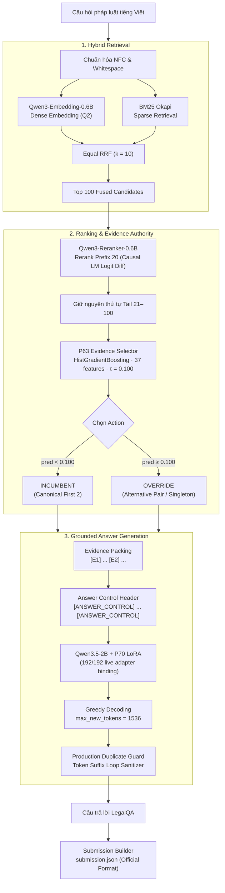

# Kiến Trúc Hệ Thống (System Architecture)

Hệ thống sản xuất **FROZEN_P3_G2_VNEXT_P63_P70** được thiết kế theo mô hình Agentic RAG phân tầng chuyên biệt, bao gồm 3 phân hệ chính:
1. **Hybrid Retrieval:** Truy xuất lai kết hợp BM25 và Dense Embedding Qwen3 qua cơ chế Equal RRF ($k=10$).
2. **Ranking & Evidence Authority:** Xếp hạng lại thần kinh trên Prefix 20 và bộ chọn căn cứ P63 ($\\tau = 0.100$).
3. **Grounded Answer Generation:** Đóng gói ngữ cảnh `[ANSWER_CONTROL]`, bộ sinh `Qwen3.5-2B` + P70 LoRA và bộ lọc lặp vòng sản xuất.

---

## 1. Sơ Đồ Kiến Trúc Hệ Thống (Architecture Flowchart)

---

## 2. Bảng Thành Phần Kiến Trúc Sản Xuất (Component Specification Table)

| Thành Phần | Dữ Liệu Đầu Vào | Thao Tác Kỹ Thuật | Dữ Liệu Đầu Ra | Cấu Hình Đóng Băng |
|---|---|---|---|---|
| **Chuẩn Hóa (Normalization)** | Câu hỏi thô | Chuẩn hóa Unicode NFC & gộp khoảng trắng thừa | Normalized Query | Tất định |
| **BM25 Sparse Retrieval** | Normalized Query + Corpus | BM25Okapi lexical retrieval ($k_1=1.5, b=0.75$) | Top 100 Sparse Hits | $k_1=1.5, b=0.75$ |
| **Dense Vector Retrieval** | Normalized Query + Corpus | `Qwen/Qwen3-Embedding-0.6B` với chỉ dẫn $Q2$ | Top 100 Dense Hits | Rev: `97b0c614be...` (1024-dim, L2 norm) |
| **RRF Fusion** | Sparse + Dense Ranks | Hợp nhất Equal RRF với $k=10$ và tie-break 3 cấp | Top 100 Fused Hits | $k=10$, candidate depth = 100 |
| **Neural Reranking** | Top 100 Fused Hits | `Qwen/Qwen3-Reranker-0.6B` (hiệu số logit yes/no) | Prefix 20 Reranked + Preserved Tail 21..100 | Rev: `e61197ed45...`, Prefix = 20 |
| **P63 Candidate Materialization** | Reranked Hits | Tạo các bộ ứng viên thay thế và trích 37 đặc trưng | 37 Feature Vectors | 37 reference-free features |
| **P63 Evidence Selector** | 37 Feature Vectors | `HistGradientBoostingRegressor` phân xử ngưỡng | Quyết định `INCUMBENT` hoặc `OVERRIDE` | $\\tau = 0.100$, 100 trees, depth=6 |
| **Evidence Packing** | Selected Chunks (1..3) | Đóng gói theo tiền tố `[E1]`, `[E2]`, `[E3]` | Formatted Legal Context | Tối đa 3 chunks |
| **Answer Control Header** | Packed Evidence + Question | Chèn khối chỉ thị `[ANSWER_CONTROL]` | Generation Prompt | Chống hallucination |
| **Generator Engine** | Generation Prompt | `Qwen/Qwen3.5-2B` + P70 LoRA greedy decoding | Raw Token Stream | Max new tokens = 1536, greedy |
| **Production Duplicate Guard** | Raw Token Stream | Cắt tỉa chu kỳ lặp vòng bằng `token_suffix_loop_sanitizer` | Sanitized Tokens | SHA256: `1d58bb1cac5b...` |
| **Submission Builder** | Cleaned Answers | Đóng gói object `question_id -> {"answer": text}` | `submission.json` | UTF-8, Official Codabench format |

---

## 3. Bảng Mô Hình & Bằng Chứng Số Hiệu (Model Identification Table)

| Vai Trò | Tên Mô Hình / Cấu Trúc | Pinned Revision / Hash | Số Tham Số / Nút Cây | Giấy Phép | Bằng Chứng Kiểm Toán SHA256 |
|---|---|---|---:|---|---|
| **Dense Retriever** | `Qwen/Qwen3-Embedding-0.6B` | `97b0c614be4d77ee51c0cef4e5f07c00f9eb65b3` | 595.776.512 | Apache-2.0 | Approved BTC |
| **Neural Reranker** | `Qwen/Qwen3-Reranker-0.6B` | `e61197ed45024b0ed8a2d74b80b4d909f1255473` | 595.776.512 | Apache-2.0 | Approved BTC |
| **Generator Base** | `Qwen/Qwen3.5-2B` | `15852e8c16360a2fea060d615a32b45270f8a8fc` | 2.213.241.664 | Apache-2.0 | Approved BTC |
| **Generator LoRA** | `P70 Adapter` | Weights SHA: `193913014b49e9...` | 21.823.488 | Apache-2.0 / Team | `193913014b49e9d1d431a44778903842cb8c98678fdf32bd1f3a45e6c020887c` |
| **Subtotal Neural** | Mạng nơ-ron và LoRA | — | **3.426.618.176** | — | **PASS (< 4B)** |
| **Evidence Selector** | `P63 Model` | Weights SHA: `1654bf0184f6be...` | 100 cây (6.030 nút cây) | Team | `1654bf0184f6be7f2bc8a715e4eba5f6d47ebc280f10481fac7a1b09bc424c38` |
| **Tổng Hệ Thống** | **Toàn bộ pipeline sản xuất** | — | **3.426.618.176 (+ 6.030 nút cây P63)** | — | **PASS (< 4B)** |

> [!NOTE]
> Báo cáo minh bạch: P63 Selector là ensemble cây quyết định phi nơ-ron (100 cây, 6.030 nút; dung lượng pickle 387.527 bytes). Dù tính riêng hay cộng tượng trưng vào tổng tham số học, toàn bộ hệ thống vẫn an toàn dưới trần 4 tỷ tham số của Ban tổ chức.

